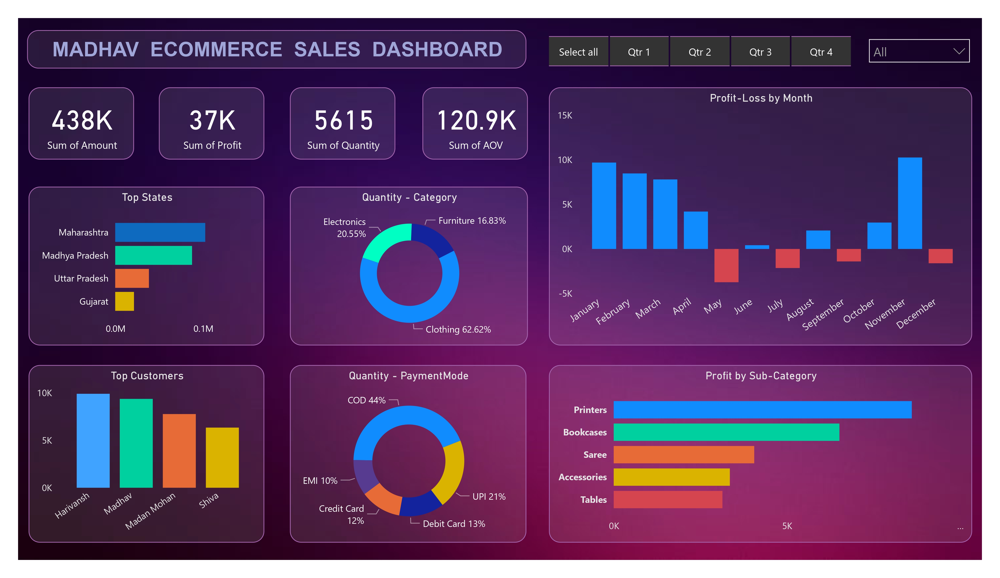

# Madhav E-Commerce Sales Dashboard

This repository contains the code and data used to generate the **Madhav E-Commerce Sales Dashboard**, which provides an insightful overview of sales performance, customer behavior, and profit analysis.

## Dashboard Overview



The **Madhav E-Commerce Sales Dashboard** provides visual insights into the following metrics:

- **Sum of Amount:** Total revenue (438K).
- **Sum of Profit:** Total profit generated (37K).
- **Sum of Quantity:** Total units sold (5615).
- **Average Order Value (AOV):** 120.9K.

### Visualizations

1. **Top States by Revenue:**  
   - Maharashtra, Madhya Pradesh, Uttar Pradesh, and Gujarat are the top-performing states in terms of sales.

2. **Top Customers by Quantity Purchased:**  
   - Harivansh, Madhav, Madan Mohan, and Shiva are the top customers based on units purchased.

3. **Quantity by Product Category:**  
   - Major categories include Clothing (62.62%), Electronics (20.55%), and Furniture (16.83%).

4. **Quantity by Payment Mode:**  
   - Cash on Delivery (44%), Debit Card (13%), UPI (21%), Credit Card (12%), and EMI (10%).

5. **Profit by Month:**  
   - Monthly profit and loss trends are shown from January to December, highlighting fluctuations in profit.

6. **Profit by Sub-Category:**  
   - Sub-category items like Printers, Bookcases, Sarees, Accessories, and Tables are analyzed based on profit.

## Dataset

The dataset used for this analysis is `test_data.csv` which contains the following columns:
- **State:** The state where the transaction occurred.
- **Category:** The product category (Clothing, Electronics, Furniture, etc.).
- **Sub-Category:** Sub-categories of products.
- **Payment Mode:** The payment mode used by customers (COD, Debit Card, UPI, etc.).
- **Quantity:** Number of units sold.
- **Amount:** Total amount for each sale.
- **Profit:** Profit generated per transaction.

The data is used to generate key metrics and visualizations in the dashboard.

## Features

- **Filter Options:** The dashboard includes the ability to filter by quarters (Q1, Q2, Q3, Q4) and show all data at once.
- **Monthly Profit Analysis:** Displays profit and loss by month, highlighting seasonal trends.
- **State-wise Analysis:** Top-performing states are displayed in a horizontal bar chart.

## Technologies Used

- **Data Visualization:** Power BI (or other visualization tools like Tableau, Matplotlib) to create the dashboard.
- **Dataset:** E-commerce transactional data (`test_data.csv`).

## Setup

1. **Clone the repository:**

   ```bash
   git clone https://github.com/abhikay18/E-commerce-Sales-Dashboard.git
   cd E-commerce-Sales-Dashboard
